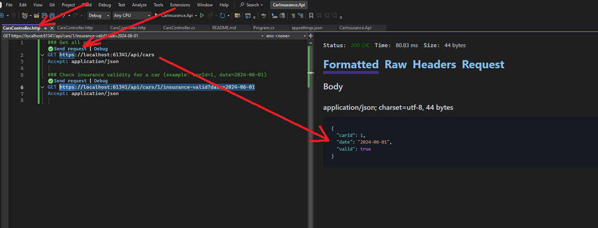

# Car Insurance API

**.NET 8** · **ASP.NET Core Web API** · **EF Core 8** · **SQLite**

This API provides endpoints to list cars and check insurance validity. It uses an in-process(in-memory) SQLite database and starts with a small set of seed data.

---

## Requirements (Software)

- .NET SDK 8.x
- Any IDE (Rider / Visual Studio 2022 17.8+ / VS Code + C# Dev Kit)
- Optional: curl/Postman for testing

Check versions:
```bash
dotnet --info
```

---

## How to Run

From the project root:
```bash
dotnet restore
```
then
```bash
dotnet build
```
at last
```bash
dotnet run --project CarInsurance.Api.csproj
```

How to Open:
- see lunchSettings.json for port number : https://localhost:61341;http://localhost:61342
- Swagger UI: the HTTPS URL in the browser (e.g., `https://localhost:61341/swagger`)
- API base URL (HTTP): the HTTP URL in the browser (e.g., `http://localhost:61342/api/cars`)

A local SQLite database file `carins.db` is created on first run.

### Sample requests

List cars with owners:
```bash
curl http://localhost:61342/api/cars
```

Check insurance validity:
```bash
curl "https://localhost:61341/api/cars/1/insurance-valid?date=2024-06-01"
```

> Use __CarsController.http__ to send or debug requests:



---

## Business Description

Core concepts:

- **Owner** — a person who owns cars.
- **Car** — a vehicle currently associated with one owner.
- **InsurancePolicy** — a policy attached to a car, valid within a date interval `[startDate, endDate]` (inclusive).

Implemented endpoints:

- `GET /api/cars` — list cars with owner information.  
- `GET /api/cars/{carId}/insurance-valid?date=YYYY-MM-DD` — check if a car has a valid insurance policy for a given date.

---

## Database Schema

- **Owners**: `Id (PK)`, `Name`, `Email`  
- **Cars**: `Id (PK)`, `Vin`, `Make`, `Model`, `YearOfManufacture`, `OwnerId (FK → Owners.Id)`  
- **Policies**: `Id (PK)`, `CarId (FK → Cars.Id)`, `Provider`, `StartDate`, `EndDate` *(nullable in seed; see tasks)*

Notes:
- VIN uniqueness is not enforced yet.  
- Overlapping policy rules are not enforced yet.

---

## Tasks

A) **Ensure policy end dates are always present and enforced**  
- Make `EndDate` required at both the model level and the database level.
- Update seed data so all policies have a valid `EndDate`.

B) **Add two new functionalities**  
1. Register an insurance claim for a car: `POST /api/cars/{carId}/claims` with `claimDate`, `description`, `amount`.  
2. Get the history of a car (regardless of owner): `GET /api/cars/{carId}/history` returning a chronological timeline (at minimum, policy periods and claims).

C) **Harden the insurance validity check against invalid values**  
- Validate the existence of `carId` (return 404 if missing).
- Validate `date` format and reject impossible dates with 400.
- Add tests around boundary cases.

D) **Add a scheduled task**  
- Add a recurring background task that logs a message **within 1 hour after** a policy expires (based on `EndDate`).
- Avoid duplicate logs across runs (e.g., track processed expirations).
- Keep the implementation simple and testable.

---

## Design Notes

- Keep controllers thin; place business logic in services.
- Return appropriate HTTP status codes.
- Use DTOs for API contracts.
- Add unit/integration tests where appropriate.
